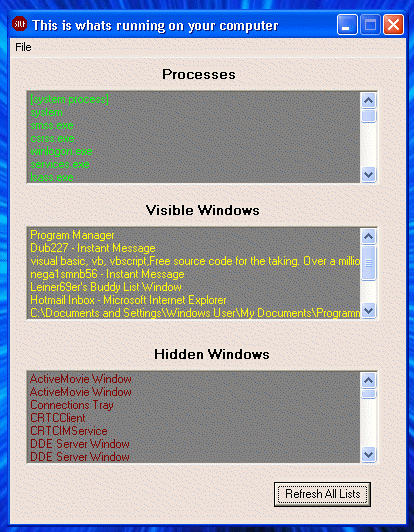



## Process Viewer

### Description

A program I wrote to see what was running on my computer. I wanted to know if I had any trojans running the in background. In this version u cant stop the tasks but it can be implemented really ez.
 
### More Info
 

             |
---                |---
**Submitted On**   |2002-03-17 14:23:58
**By**             |[Dave Lein](https://github.com/Planet-Source-Code/PSCIndex/blob/master/ByAuthor/dave-lein.md)
**Level**          |Beginner
**User Rating**    |5.0 (15 globes from 3 users)
**Compatibility**  |VB 6\.0
**Category**       |[Windows API Call/ Explanation](https://github.com/Planet-Source-Code/PSCIndex/blob/master/ByCategory/windows-api-call-explanation__1-39.md)
**World**          |[Visual Basic](https://github.com/Planet-Source-Code/PSCIndex/blob/master/ByWorld/visual-basic.md)
**Archive File**   |[Process\_Vi632133182002\.zip](https://github.com/Planet-Source-Code/dave-lein-process-viewer__1-32805/archive/master.zip)

